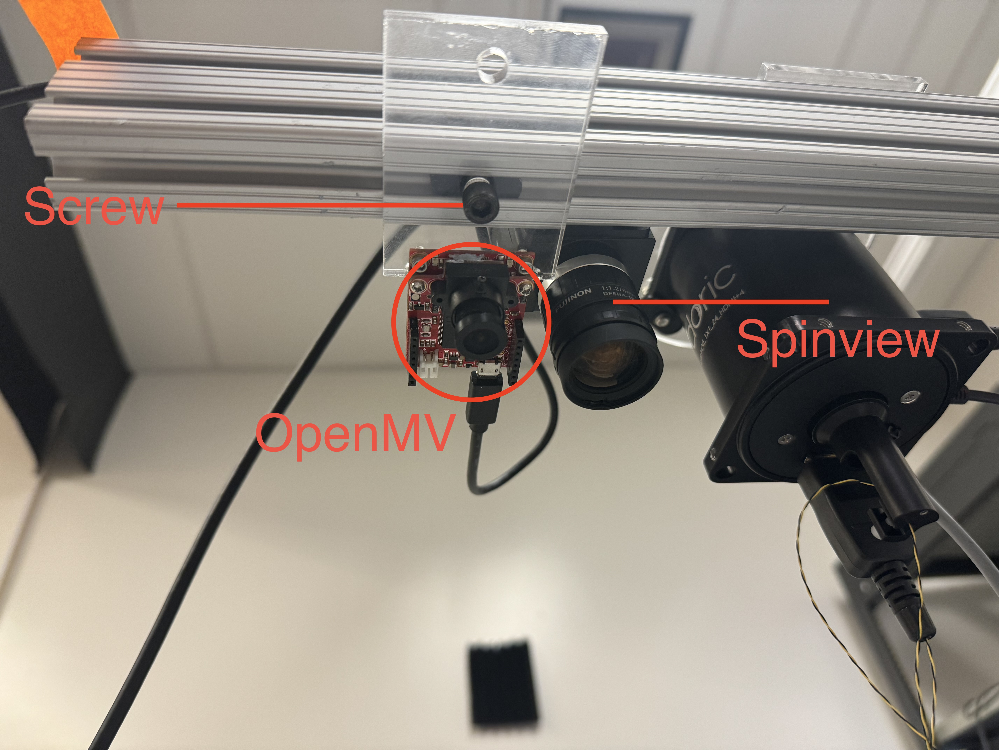

# Closed-loop Escape System
## Links
- [Lab Presentation](https://docs.google.com/presentation/d/1-WpSntKPBZUKo7lMExeI2NokXyZim15iTLS0z7BTT6Q/edit?usp=sharing)
- [Rotation Report](docs/Rotation%20Report.pdf)
- [Rotation Notebook](https://yefan2718.notion.site/Rot2-Notebook-2320cc21c8434955b051a818b1cbd9e6?pvs=4) - written notes documenting everything done during the project
- [Elena Github](https://github.com/zzhong413/mouse-tracker)
- [Elena Rotation Report](docs/Elena_Zhong_RotationReport.pdf)

## System Schematic

## Calibration Procedures
### Loading GRBL onto Gantry
In case the microcontroller that controls the gantry is fried, we need to buy a new arduino nano and load the software onto that it for controlling the gantry. 

There is a user manual that comes with the gantry: 

Chapter 5 describes the process for loading the grbl control onto the microcontroller. 

However, the link on the above page for downloading the software is broken. Alternatively, download Engraver Master from: https://www.kysson.com/wp-content/uploads/setup.exe. Then basically follow the steps in the user manual, there's also an online tutorial: https://www.kysson.com/engraver-master-software/. The rough steps are as follows:
- connect the new nano to the PC, and open Engraver Master
- on the top right corner there’s a dropdown menu, select “Update Board Firmware”

However, after loading the firmware onto the nano, the gantry likely behaves a bit different because it's using it's default settings, which is designed for drawing. These settings can be programmed with Gcode, with documentaiton here: 
- https://github.com/grbl/grbl/wiki/Configuring-Grbl-v0.9
- https://tormach.com/programming-g-code

### Arena and Camera Calibration

The arena position can be calibrated by the four screws on the corner. The position of the arena should be calibrated together with the camera. 

The orientation of the OpenMV camera is determined only by one screw. When positioning the camera, first connect the camera to the PC and open the openmv IDE, connect to the IDE to the camera, and open `openmv/camera_calibration.py`. Leave only the line `img = sensor.snapshot()` in the while loop and run the script. on the top right of the IDE it should show the raw camera image that's updated in real time. 

Position the camera and arena together until there's maximum space between the arena edges and the picture edges in the IDE view. Verify by changing the line `img = sensor.snapshot()` to `img = sensor.snapshot().lens_corr(1.5)` and verify that the entire arena space still shows up in the picture. The number 1.5 is determined by trial and error and might need to change if the distance between the camera and arena is changed. 

Finally, stop the program in the IDE. The last picture that's taken with the camera should still be at the top right corner of the IDE. Sequentially click on the four corners of the arena in the picture and record their pixel coordinates in the variable `points`, which contains a list of tuples. These points will be used for rotation correction. Now, replace the line `img = sensor.snapshot().lens_corr(1.5)` to `img = sensor.snapshot().lens_corr(1.5).rotation_corr(corners=points)` and run the program. Verify that now the IDE should show the arena corners and edges perfectly aligned to the corners and edges of the picture. 

Now arena calibration is complete. The above steps need to be repeated if the arena position or camera position is changed. 

### Filter Calibration
A color filter is defined by 6 numbers, corresponding to the min, max values of LAB channels. ([find_blobs](https://docs.openmv.io/library/omv.image.html#image.Image.find_blobs))

To determine values of filters for an object you want to detect, put that object in the arena, run the `openmv/camera_calibration.py` script, once the top right corner of the IDE has a picture, stop the program, go to the threshold editor. 

A popup should occur, click "Frame Buffer", and then you can adjust the values until getting a filter that selects the object. 

### Corner and Edge Calibration
After the above steps, we need to determine the corners and boundaries for the gantry. 

Put a puck on the gantry. Start openmv IDE, run the camera calibration script with the blob detection enabled in the while loop, and print the center x and y positions of the blob. 

Now go to the gantry and manually move the gantry to the four corners of the arena, and record the xy coordinates that's printed out in the IDE. These are recorded in the `edges` variable for my experiments. Then from these four points, determine the x_min, x_max, y_min, y_max values that will define the maximum boundaries that the gantry will move to during the actual experiment. These values for my experiment can be found in `escape.py`. 

Lastly, measure the length and width of the arena in milimeters, and also determine the resolution of the image the camera took (this can be done by dragging a rectangular area that covers the entire image in the openmv IDE), and define the `corr_vec` variable in `escape.py` as [x_mm / x_pixel, y_mm / y_pixel]. This value is used to convert the pixel positions of the mouse and chip into milimeter positions. 

The above steps are to determine the edges, corners, and correction vector of the experiment. If the arena or camera is moved, or the camera resolution is changed, they will need to be adjusted. 

## Debug Methods

Debugging the real time system is kinda challenging especially during an experiment session. Near the end of `escape.py`, several figures are saved after ctrl+C is pressed for ease of quick debugging. 

However, for more refined debugging, look into `overlay.py` which matches the logs of the real-time program to the video saved by the spinview camera. **NOTE: THE UNIX TIMESTAMP OF LAST MODIFIED TIME OF THE SPINVIEW VIDEO MUST BE SAVED IN ORDER TO MATCH THE LOGS WITH THE VIDEO.** This can be done by `os.path.getmtime(path)` in python. Also, chopping videos into multiple segments when saving the video causes lost frames. 

## Folder Structure
- `previous` - files directly copied from Elena's repo
- `examples` - files directly copied from [OpenMV github](https://github.com/openmv/openmv), which under `scripts/examples` contains numerous example scripts on how to do things
- `docs` - files used by this readme file and other documentation
- `openmv` - all files that is potentially loaded onto openmv camera. Most important ones are `camera_calibration.py` for camera calibration and `escape.py` for the main program. 
- `exploring` - all scripts used for downstream data processing. 

## Todos
- openmv send square wave to to neural pixel system for synchronization with neural data
- secure gantry in more long term way, also need to try to isolate vibration caused by gantry movements. 
